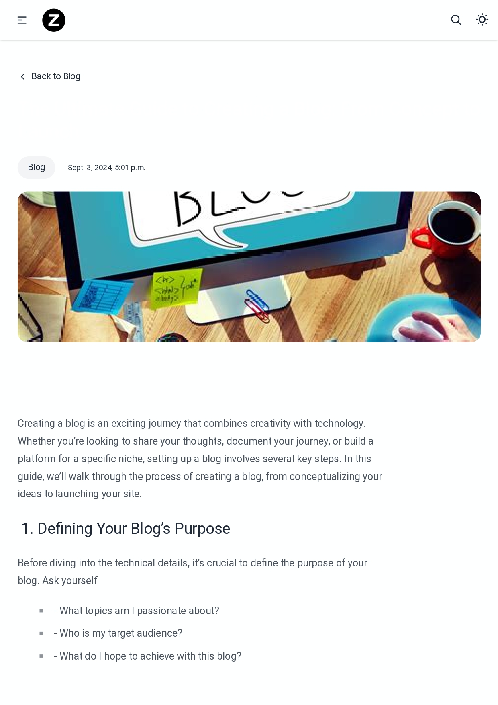

# Django SEO Optimize Blog Website
# Main page 


This project is a Django-based blog website optimized for SEO, utilizing Tailwind CSS, Daisy UI, and a rich text editor. It features a clean and modern design, making it easy for users to manage and view blog content.
# search page

# Category items 


## Features

- **Search Functionality**: Users can search for blog posts by title.
- **Category-Based Filtering**: Blogs are organized by category, and users can filter content based on these categories.
- **Social Media Integration**: Easy sharing of blog posts on popular social media platforms.
- **SEO Optimization**: The website is optimized for search engines to enhance visibility.
- **Rich Text Editor**: Supports rich text editing for creating and managing blog posts.
- **Sitemap & RSS**: Includes a sitemap and RSS feed for better content discovery.

## Installation

1. Clone the repository:
   ```bash
   git clone https://github.com/bytebrain3/Django-seo-optimize-blog-website.git
   ```

2. Navigate to the project directory:
   ```bash
   cd Django-seo-optimize-blog-website
   ```

3. Install dependencies:
   ```bash
   pip install -r requirements.txt
   cd Django-seo-optimize-blog-website/blog
   ```

4. Apply migrations:
   ```bash
   python manage.py migrate
   ```

5. Create a superuser for admin access:
   ```bash
   python manage.py createsuperuser
   ```

6. Run the development server:
   ```bash
   python manage.py runserver
   ```
# Blog post page


## Usage

- Access the admin panel at `http://localhost:8000/admin` to manage blog posts.
- Visit `http://localhost:8000/` to view and interact with the blog.

## Deployment

For hosting, you can deploy this project on any platform that supports Django, such as Heroku, PythonAnywhere, or a VPS.

## Contributing

Feel free to submit issues and pull requests if you'd like to contribute to the project.

## License

This project is licensed under the MIT License.


